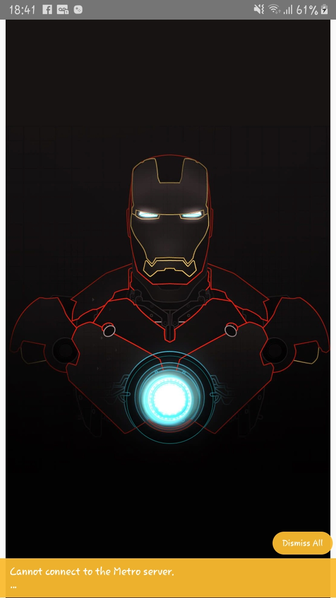

<h1 align="center">
    
    Iron Man - Animation react-native

  <a href="#-projeto">Projeto</a>&nbsp;&nbsp;&nbsp;|&nbsp;&nbsp;&nbsp;
  <a href="#contribuição">Contribuição</a>&nbsp;&nbsp;&nbsp;
  
</h1>

## 💻 Projeto

App created in react-native using the lottie library. Iron man animation.

Animated apps are a delicacy, and having native performance animations built from After Effects running on Android and iOS with very little effort is even better.

Lottie library that natively renders animations exported from After Effects in JSON format on both iOS and Android within React Native.

animation library: https://lottiefiles.com/

## Contribuição

- Primeiro faça um fork desse repositório;
- Crie uma branch com a sua feature: `git checkout -b minhafeature`;
- Faça commit das suas alterações: `git commit -m 'feat: Nova feature'`;
- Faça push para a sua branch: `git push origin minhafeature`.

Depois que o merge da sua pull request for feito, você pode deletar a sua branch.
